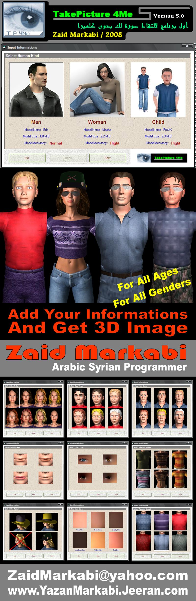



## Take Picture For Me

### Description

&lt; Take Picture 4 Me &gt; is powerful engine, which you can add your informations and the program will create real 3D image for you.

also you can add hats, glasses and other items to your person.

then you can add sunlight and other options.

finally, export it to BMP file from any corner you want.

and now, see screenshot and GET IT NOW..

NOTICE :

It's just DEMO version.

you can get full version from my website ( for free, about 40 M.b )

TakePicture4Me Ver.5 - How to Setup ?

----

1- Rename file [ Take Picture 4 Me - Ver.5.zaid ] to [ Take Picture 4 Me - Ver.5.Rar ]

2- Unzip it using WinRar or other program

3- Setup [ MeshesSketch ActiveX.exe ] *included*

4- Open my source code

NOTICE :

----

this is just demo code , you can get full version from my website,

in this DEMO version :

1- 3D High Quality Models

2- 3D Items Added ( glasses, hats, ... )

3- 3D Light supported

4- 3D Sunlight Added

5- Export as BMP

in FULL version :

1- 3D Movements added ( Dancing )

2- 3D Rooms supported

3- 3D Music wideround supported

4- Export to JPEG & BMP
 
### More Info
 

TakePicture4Me Ver.5 - About

----

&lt; Take Picture 4 Me &gt; is powerful engine, which you can add your informations and the program will create real 3D image for you.

also you can add hats, glasses and other items to your person.

then you can add sunlight and other options.

finally, export it to BMP file from any corner you want.

and now, see screenshot and GET IT NOW..

NOTICE :

It's just DEMO version.

you can get full version from my website ( for free, about 40 M.b )

TakePicture4Me Ver.5 - How to Setup ?

----

1- Rename file [ Take Picture 4 Me - Ver.5.zaid ] to [ Take Picture 4 Me - Ver.5.Rar ]

2- Unzip it using WinRar or other program

3- Setup [ MeshesSketch ActiveX.exe ] *included*

4- Open my source code

NOTICE :

----

this is just demo code , you can get full version from my website,

in this DEMO version :

1- 3D High Quality Models

2- 3D Items Added ( glasses, hats, ... )

3- 3D Light supported

4- 3D Sunlight Added

5- Export as BMP

in FULL version :

1- 3D Movements added ( Dancing )

2- 3D Rooms supported

3- 3D Music wideround supported

4- Export to JPEG & BMP

----

Zaid Markabi - Arabic Syrian Programmer

Email  : ZaidMarkabi@yahoo.com

WebSite : www.YazanMarkabi.Jeeran.com

----

             |
---                |---
**Submitted On**   |2008-12-26 21:48:00
**By**             |[Zaid Markabi](https://github.com/Planet-Source-Code/PSCIndex/blob/master/ByAuthor/zaid-markabi.md)
**Level**          |Advanced
**User Rating**    |4.2 (21 globes from 5 users)
**Compatibility**  |VB 5\.0, VB 6\.0
**Category**       |[DirectX](https://github.com/Planet-Source-Code/PSCIndex/blob/master/ByCategory/directx__1-44.md)
**World**          |[Visual Basic](https://github.com/Planet-Source-Code/PSCIndex/blob/master/ByWorld/visual-basic.md)
**Archive File**   |[Take\_Pictu2141571262009\.zip](https://github.com/Planet-Source-Code/zaid-markabi-take-picture-for-me__1-71679/archive/master.zip)

